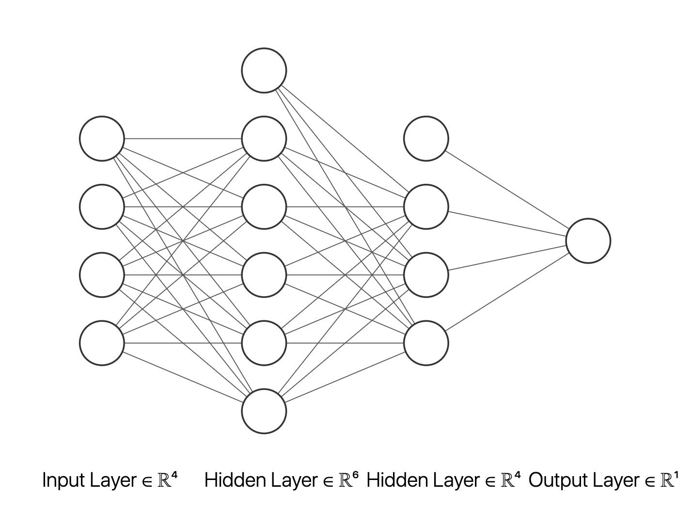

```{r setup, include=FALSE}
knitr::opts_chunk$set(echo = TRUE)
```

# PART I. Loading data and Define helper functions
```{r}
Vdata <- read.csv("../data/videogames.csv")
#Vdata <- Vdata[as.numeric(as.character(Vdata$Year_of_Release)) > 2009, ] # only game after 2010
Vdata <- Vdata[(!is.na(Vdata$Critic_Score)),] # remove missing values

Anova_test <- function(classifier, data = Vdata) {
  summary(aov(data$Global_Sales ~ data[[classifier]]))
}

get_freq <- function(x, breaks) {
  len <- length(breaks)
  res <- numeric(len)
  for (i in seq_len(len)) {
    res[i] <- sum(breaks[i] < x & x <= breaks[i+1])
  }
  res
}

get_density <- function(x, breaks, by) {
  res <- get_freq(x, breaks) / (length(x) * by)
  res
}

get_density_idx <- function(gs) {
  ceiling(20 * gs)
}

testclass <- function(classifier, data=Vdata){
  table <- tapply(Vdata$Global_Sales, Vdata[[classifier]], function(x){x})
  table[[1]] <- NULL
  par(mfrow = c(1, 2))
  boxplot(table, las = 3, cex=0.2, pch=20)
  boxplot(table, ylim=c(0,5), las = 3, cex=0.2,pch=20)
  Anova_test(classifier)
}

rangef <- function(x, divider=5) {
  x %/% divider * divider + divider/2
}
```

# PART II. Heuristically explore the effect of each paramemter

### Anova test on Genre
```{r echo=FALSE}
testclass(4)
```

### Avona test on Platform
```{r echo=FALSE}
testclass(4)
```

### Anova test on Publisher
```{r echo=FALSE}
testclass(5)
```


# Plot Global Sale ~ Paramemter

### Critic_Score defines an upperbound
```{r echo=FALSE}
plot(Vdata$Critic_Score, Vdata$Global_Sales, cex=0.1, ylim=c(0,20), xlab="Critic Score", ylab="Global Sale")
x <- seq(0,100,len=1000)
y <- 1/1500*x^2
lines(x,y,lty=3,col="red")
legend("topleft", "1/1500 * x^2", lty=2, col="red", inset=0.05)
```

### Test multicolineality
```{r}
cor.test(as.numeric(as.character(Vdata$User_Score)), Vdata$Critic_Score)
```

# Focus on Critic score

### Make a box plot for Global Sale ~ Critic Score
```{r echo=FALSE}
x <- seq(0,100,len=1000)
y <- 1/1500*x^2
idx <- Vdata$Global_Sales <= (Vdata$Critic_Score)^2/1500
plot((Vdata$Critic_Score)[idx],Vdata$Global_Sales[idx], cex=0.1, xlab="Critic", ylab="Global Sale")
lines(x,y,lty=3,col="red")
plot(factor((Vdata$Critic_Score)[idx]), ylim=c(0,5),Vdata$Global_Sales[idx], cex=0.1)
f <- 1/20000000*x^4+1/1500000000*x^5+0.2
t <- 1/50000000*x^4
m <- 1/80000000*x^4+1/2000000000*x^5+0.1
lines(x,f,lty=2,col="red")
lines(x,t,lty=2,col="blue")
lines(x,m,lty=2,col="green")
```

### Group the boxplot by range of 5
```{r}
Vdata <- Vdata[idx, ]
Vdata <- Vdata[Vdata$Global_Sales <= 4, ]
ran <- rangef(Vdata$Critic_Score)
plot(factor(ran), ylim=c(0,5),Vdata$Global_Sales, cex=0.1)
```

### Zoom in to each box, and transform as histgram
```{r}
for (i in seq(11)) {
  hist(Vdata$Global_Sales[ran == (32.5+5*i)], breaks=seq(0,6,by=0.05), main =
         paste("Sale for Critic Score within ", "[",as.character(32.5+5*i-2.5), ",",
        as.character(32.5+5*i+2.5),"]"), xlab="Global Sale", probability = TRUE)
  lines(seq(0,4,by=0.05)+0.025, get_density(Vdata$Global_Sales[ran == (32.5+5*i)], seq(0,4,by=0.05), 0.05), col="blue")
  legend("topright", "Density Curve", lwd = 0.5, col = "blue")
}
```

# Set up of the problem

- The goal is to approximate the blue density curve given the value of Critic Score
- We want to get the distribution density function of Global Sale given Critic Score: $$f(sale, critic)$$
- We choose MSE as objective function: $$\sum(f-\hat f)^2$$

# Clear up the dataframe and save it to csv file
```{r}
ran <- rangef(Vdata$Critic_Score)
dataf <- data.frame("Global_Sale" = numeric(0), "Critic_Score" = numeric(0), "Density" = numeric(0))
for (i in seq(11)) {
  gs <- Vdata$Global_Sales[ran == (32.5+5*i)]
  cs <- Vdata$Critic_Score[ran == (32.5+5*i)]
  ccount <- log10(Vdata$Critic_Count[ran == (32.5+5*i)])
  ds <- get_density(Vdata$Global_Sales[ran == (32.5+5*i)], seq(0,4,by=0.05), 0.05)
  ds_idx <- get_density_idx(gs)
  cs_range <- 32.5+5*i
  ds <- ds[ds_idx]
  dataf <- rbind(dataf, cbind(gs, cs_range,ccount, cs,ds))
}
# write.csv(dataf, "CS_GL_FQ.csv")
```

# Neural Network Setting ANN2 (The latest one)

{width=350, height=300}

- Four input Node: Critic Score, $log(\text{Critic Count})$, Global Sale, Bias
- Activation Function: Exponential Linear Unit(ELU) $$\text{elu}(k) = \begin{cases}k  & k>0\\\alpha(e^k-1) & z \leq 0\end{cases}$$
- Optimizer: Adam
- Train the model with 50% of the data, test with 50% of the data
  - Selected with [sklearn.model_selection.train_test_split](https://scikit-learn.org/stable/modules/generated/sklearn.model_selection.train_test_split.html)
- Result: MSE = 0.060838572680950165

# Apply the model to all data point and plot on each histgram
```{r}
Pdata <- read.csv('predictedData.csv')
for (i in seq(11)) {
  hist(Vdata$Global_Sales[ran == (32.5+5*i)], breaks=seq(0,4,by=0.05), main =
         paste("Sale for Critic Score within ", "[",as.character(32.5+5*i-2.5), ",",
        as.character(32.5+5*i+2.5),"]"), xlab="Global Sale", probability = TRUE)
  lines(seq(0,4,by=0.05)+0.025, get_density(Vdata$Global_Sales[ran == (32.5+5*i)], seq(0,4,by=0.05), 0.05), col="blue")
  gs <- Pdata$gs[Pdata$cs_range == (32.5+5*i)]
  y <- Pdata[[6]][Pdata$cs_range == (32.5+5*i)]
  points(gs, y, col='red', pch=19,cex=0.5)
  legend("topright", c("Density Curve", "Predicted By Neural Network"), lwd = c(0.5, NA), col = c("blue", 'red'), pch=c(NA, 19))
}
```

# Neural Network Setting ANN (The best one I got)

{width=350, height=300}

- Four input Node: Critic Score, $log(\text{Critic Count})$, Global Sale, Bias
- Activation Function: Exponential Linear Unit(ELU) $$\text{elu}(k) = \begin{cases}k  & k>0\\\alpha(e^k-1) & z \leq 0\end{cases}$$
- Optimizer: Adam
- Train the model with 50% of the data, test with 50% of the data
  - Selected with [sklearn.model_selection.train_test_split](https://scikit-learn.org/stable/modules/generated/sklearn.model_selection.train_test_split.html)
- Result: MSE = 0.039713695603222736

```{r}
Pdata <- read.csv('predictedData2.csv')
for (i in seq(11)) {
  hist(Vdata$Global_Sales[ran == (32.5+5*i)], breaks=seq(0,4,by=0.05), main =
         paste("Sale for Critic Score within ", "[",as.character(32.5+5*i-2.5), ",",
        as.character(32.5+5*i+2.5),"]"), xlab="Global Sale", probability = TRUE)
  lines(seq(0,4,by=0.05)+0.025, get_density(Vdata$Global_Sales[ran == (32.5+5*i)], seq(0,4,by=0.05), 0.05), col="blue")
  gs <- Pdata$gs[Pdata$cs_range == (32.5+5*i)]
  y <- Pdata[[6]][Pdata$cs_range == (32.5+5*i)]
  points(gs, y, col='red', pch=19,cex=0.5)
  legend("topright", c("Density Curve", "Predicted By Neural Network"), lwd = c(0.5, NA), col = c("blue", 'red'), pch=c(NA, 19))
}
```
